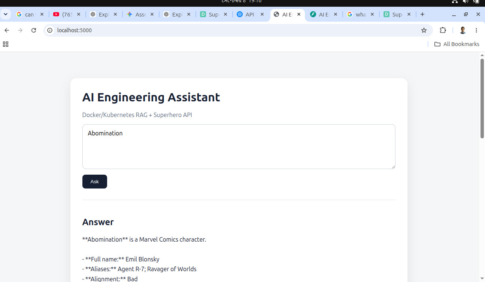
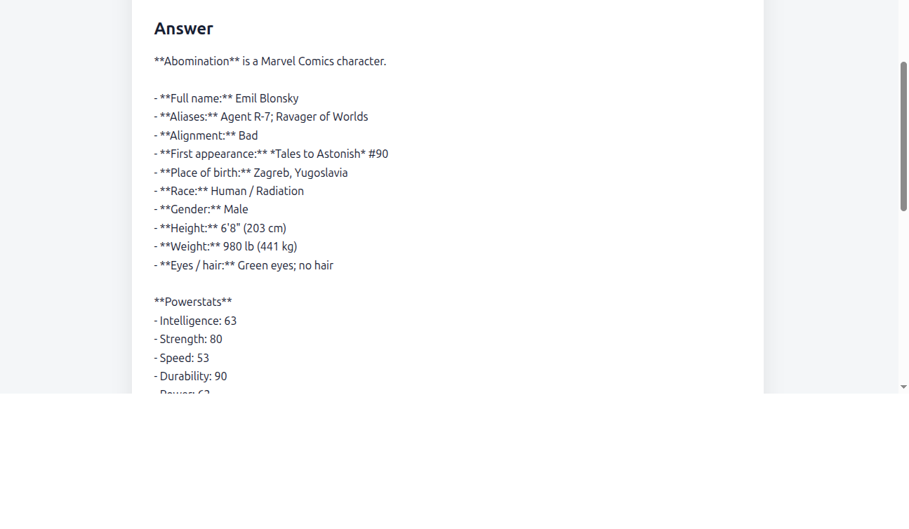
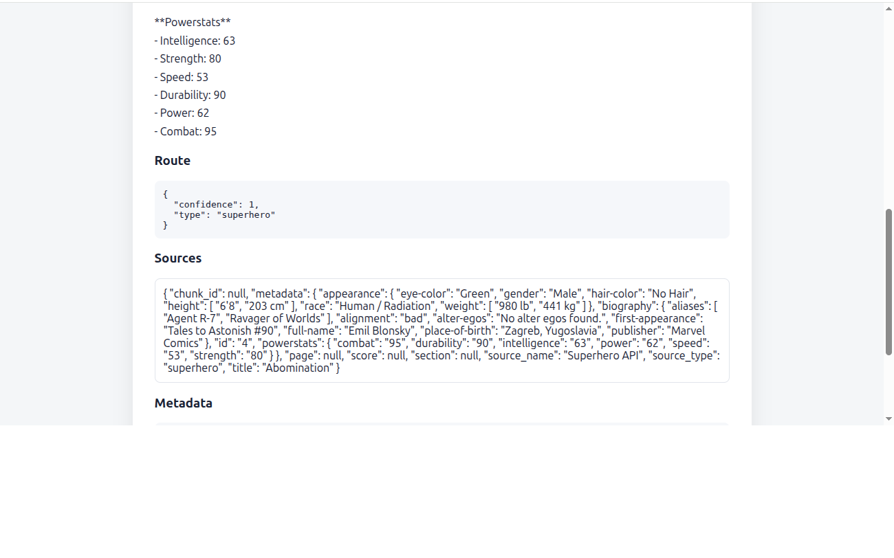
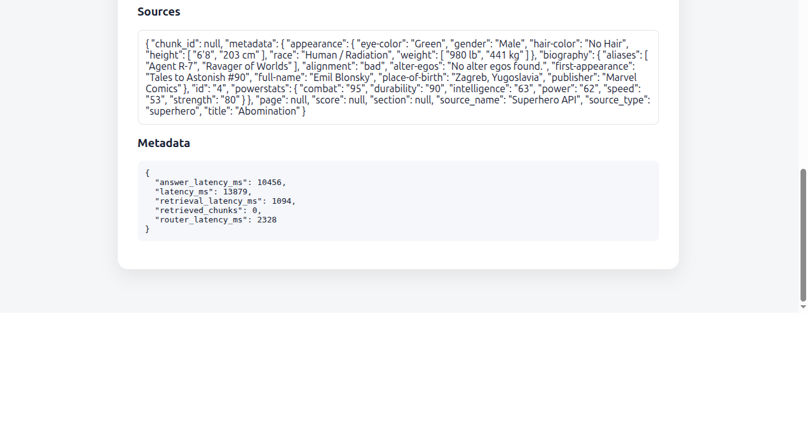
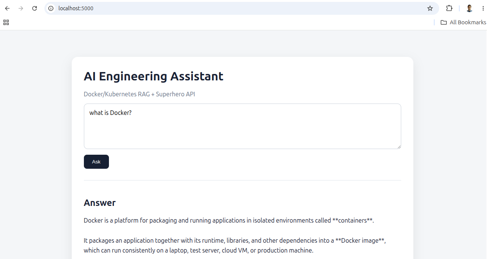
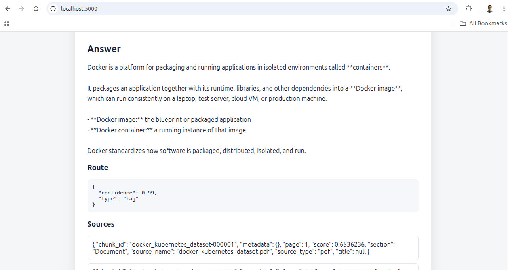
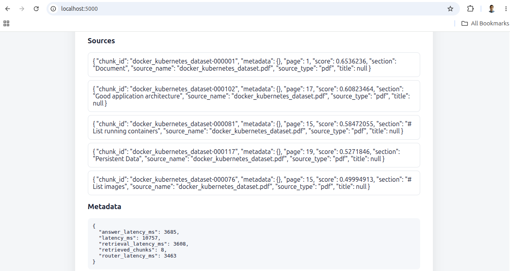

# AI Engineer Assessment — Production RAG Chatbot

A modular FastAPI + Flask AI chatbot built around:

- FastAPI backend
- Flask/Jinja2 frontend
- OpenAI Responses API
- LLM-based source routing with structured output
- OpenAI `text-embedding-3-large`
- Qdrant vector database
- Section-aware PDF chunking
- Similarity retrieval + metadata filtering
- Superhero API integration
- Docker Compose for local development
- Pytest unit/integration/evaluation tests
- Structured logging
- Health/readiness endpoints

The assessment requires a single `POST /ask` endpoint, superhero data from the Superhero API, a hosted LLM, and source attribution. The implementation keeps the public API at `POST /api/v1/ask` and also exposes `POST /ask` as a compatibility alias.

## Important model note

The project defaults to the currently documented GPT-5.6 family:

```env
ROUTER_MODEL=gpt-5.6-luna
ANSWER_MODEL=gpt-5.6-terra
EMBEDDING_MODEL=text-embedding-3-large
```

All model names are configuration values. If a model is unavailable to your OpenAI project, change the `.env` values without changing application code.

## 1. Prerequisites

- Docker + Docker Compose
- Python 3.12+ for local development
- OpenAI API key
- Superhero API token
- `docker_kubernetes_dataset.pdf`


## 2. How to run the Application  
  ### 2.1) Clone the repository using    
  ```bash
  git clone https://github.com/hasan-moni-321/ai-engineer-assessment-Kamrul-Hasan.git  
  ```  

  ### 2.2) go to the main project folder using     
  ```bash
  cd ai-engineer-assessment-Kamrul-Hasan  
  ```

  ### 2.3) copy .env.example using    
  ```bash
  cp .env.example .env  
  ```

  ### 2.4) Put your credentials in .env    
  ```bash
  OPENAI_API_KEY=your_openai_key  
  ```  
  ```bash
  SUPERHERO_API_TOKEN=your_superhero_token  
  ```

  ### 2.5) create python virtual environment     
  ```bash
  python3 -m venv .venv  
  source .venv/bin/activate  
  ```  

  ### 2.6) Install dependencies    
  ```bash
  pip install -U pip  
  ```    
  ```bash
  pip install -e ".[dev]"  
  ```    
  
  ### 2.7) Install Qdrant  
  ```bash
  docker compose up -d qdrant  
  ```    

  ### 2.8) Ingest the PDF:    
  ```bash
  python3 -m backend.ingestion.ingest --pdf data/docker_kubernetes_dataset.pdf  
  ```

  ### 2.9) Start FastAPI:    
  ```bash
  uvicorn backend.app.main:app --reload --host 0.0.0.0 --port 8000
  ```   
  
  ### 2.10) Then start Flask in another terminal:     
  ```bash
  python3 frontend/app.py  
  ```

  ### 2.11) Open a browser and paste below url     
  ```bash
  http://localhost:5000  
  ```

  ### 2.12)  for API documentation paste below url in a new browser tab     
  ```bash
  http://localhost:8000/docs  
  ```


## 3. Some Screenshot

### 3.1) For "Abomination" (super hero example)





### 3.2) For "Docker" (my own database)  





## 3. Run everything with Docker Compose

After placing the PDF in `data/`:

```bash
docker compose --profile app up --build
```

Backend:

```text
http://localhost:8000
```

Frontend:

```text
http://localhost:5000
```

## 4. Example API request

```bash
curl -X POST http://localhost:8000/api/v1/ask \
  -H "Content-Type: application/json" \
  -d '{"question":"What is a Kubernetes Pod?"}'
```

Example combined question:

```bash
curl -X POST http://localhost:8000/api/v1/ask \
  -H "Content-Type: application/json" \
  -d '{"question":"Compare Kubernetes self-healing with Wolverine regeneration."}'
```

## 5. Architecture

```text
Browser
  |
  v
Flask
  |
  v
FastAPI
  |
  v
LLM Router
  |
  +-------------------+-------------------+
  |                   |                   |
  v                   v                   v
RAG                Superhero            BOTH
  |                   |                   |
  v                   v                   |
Qdrant             Superhero API         |
  |                   |                   |
  +-------------------+-------------------+
                      |
                      v
                Answer LLM
                      |
                      v
             Answer + Sources
```

Offline ingestion:

```text
PDF
 |
 v
PyMuPDF
 |
 v
Section-aware chunker
 |
 v
OpenAI embeddings
 |
 v
Qdrant
```

## 6. Retrieval defaults

```env
CHUNK_TARGET_TOKENS=500
CHUNK_MIN_TOKENS=200
CHUNK_MAX_TOKENS=800
CHUNK_OVERLAP_TOKENS=75

RAG_TOP_K=8
RAG_FINAL_CONTEXT_K=5
RAG_SCORE_THRESHOLD=0.35
```

These are starting points. Tune them using the evaluation dataset.

## 7. Tests

```bash
pytest
```

Coverage:

```bash
pytest --cov=backend --cov-report=term-missing
```

Lint:

```bash
ruff check .
ruff format --check .
```

## 8. Production deployment

For production:

- use Qdrant Cloud rather than the development Qdrant container
- store API keys in a secret manager
- terminate TLS at a reverse proxy/load balancer
- run multiple stateless FastAPI replicas
- configure distributed rate limiting
- add OpenTelemetry/metrics backend
- pin tested model versions where reproducibility is required
- run ingestion as a controlled release/job, not as web startup
- monitor latency, errors, token usage, retrieval scores and route distribution

The application itself remains stateless so the backend can scale horizontally.

## 9. Assessment compatibility

The assessment explicitly requires:

- FastAPI
- a single `POST /ask`
- dataset questions
- superhero questions
- choosing the correct source or both
- Superhero API `/api/{token}/search/{name}`
- hosted LLM
- source attribution
- validation/error handling/tests

This project preserves those requirements while adding modular RAG and production engineering.
